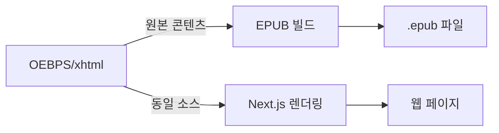

# 📚 알고리즘 학습 하이브리드 eBook 프로젝트

> EPUB 3.0 표준 전자책과 Next.js 웹 애플리케이션을 동시에 지원하는 하이브리드 교육 플랫폼

## 🎯 프로젝트 개요

이 프로젝트는 중고등학생을 위한 **알고리즘 학습 플랫폼**으로, 다음과 같은 특징을 가집니다:

- **📖 EPUB 3.0 표준 전자책**: 다양한 eReader에서 읽을 수 있는 표준 전자책
- **🌐 웹 애플리케이션**: 브라우저에서 접근 가능한 인터랙티브 학습 환경
- **🔄 하이브리드 구조**: 하나의 콘텐츠로 두 가지 형태 동시 제공
- **🎮 인터랙티브 학습**: 시뮬레이션, 실습, 진도 추적 기능

### 📊 현재 상태 (2025년 1월)
- ✅ EPUB 3.0 구조 완성
- ✅ 웹 퍼블리싱 12개 페이지 구현
- ✅ 알고리즘 시뮬레이션 시스템 완성
- ✅ 진도 추적 시스템 구현
- ✅ 반응형 디자인 적용

## 🛠 기술 스택

### 웹 애플리케이션
- **Framework**: Next.js 15 (App Router)
- **UI Library**: shadcn/ui + Tailwind CSS
- **Language**: TypeScript
- **Icons**: Lucide React

### EPUB 3.0
- **Content**: XHTML 1.1
- **Styling**: CSS 3
- **Interactivity**: JavaScript ES6+
- **Standard**: EPUB 3.0 with scripted content

## 📂 프로젝트 구조

```
epub-algorithms/
├── 📱 웹 애플리케이션
│   ├── app/                    # Next.js 페이지
│   ├── components/             # React 컴포넌트
│   ├── hooks/                  # React Hooks
│   └── lib/                    # 유틸리티
│
├── 📖 EPUB 콘텐츠
│   ├── META-INF/              # EPUB 메타데이터
│   │   └── container.xml
│   ├── OEBPS/                 # 콘텐츠 루트
│   │   ├── content.opf        # 패키지 문서
│   │   ├── nav.xhtml          # 네비게이션
│   │   ├── css/               # 스타일시트
│   │   ├── js/                # JavaScript
│   │   └── xhtml/             # 콘텐츠 페이지
│   └── mimetype               # EPUB 식별자
│
├── 📚 문서
│   └── docs/
│       ├── README.md          # 이 파일
│       ├── prd.md             # 제품 요구사항
│       ├── development-notes.md # 개발 노트
│       └── notes.txt          # 빠른 메모
│
└── 🔧 설정 파일
    ├── package.json
    ├── tsconfig.json
    └── next.config.mjs
```

## 🔄 하이브리드 개발 워크플로우

### 1. 콘텐츠 동기화 전략



### 2. 개발 프로세스

1. **콘텐츠 작성**: `OEBPS/xhtml/`에서 XHTML 파일 편집
2. **스타일 적용**: `OEBPS/css/`에서 CSS 작성
3. **인터랙티브 기능**: `OEBPS/js/`에서 JavaScript 구현
4. **웹 통합**: `app/` 폴더에서 Next.js 페이지 생성
5. **동시 테스트**: EPUB 리더와 웹 브라우저에서 확인

### 3. 파일 동기화 방법

```bash
# 옵션 1: 심볼릭 링크 (개발 환경)
ln -s ../OEBPS public/OEBPS

# 옵션 2: 빌드 시 복사 (프로덕션)
cp -r OEBPS public/
```

## 🚀 시작하기

### 개발 환경 설정

```bash
# 의존성 설치
pnpm install

# 개발 서버 실행
pnpm dev

# EPUB 빌드 (스크립트 필요)
pnpm build:epub
```

### EPUB 빌드 방법

```bash
# EPUB 파일 생성
cd ..
zip -r epub-algorithms.epub epub-algorithms/mimetype epub-algorithms/META-INF epub-algorithms/OEBPS -x "*.DS_Store"
```

## 📝 개발 가이드

### 새로운 콘텐츠 추가

1. **XHTML 페이지 생성**
   ```
   OEBPS/xhtml/new-content.xhtml
   ```

2. **content.opf에 등록**
   ```xml
   <item id="new-content" href="xhtml/new-content.xhtml" 
         media-type="application/xhtml+xml" properties="scripted"/>
   ```

3. **웹 라우트 생성**
   ```
   app/new-content/page.tsx
   ```

### 스타일 가이드

- **EPUB 호환성**: XHTML 1.1 엄격 모드 준수
- **반응형 디자인**: 모든 화면 크기 지원
- **접근성**: WCAG 2.1 AA 기준 준수

## 🧪 테스트

### EPUB 검증
- [EPUB Validator](https://validator.idpf.org/)
- Adobe Digital Editions
- Apple Books

### 웹 테스트
- Chrome DevTools
- Lighthouse 성능 측정
- 모바일 기기 테스트

## 📄 라이선스

- 콘텐츠: Creative Commons BY-SA 4.0
- 코드: MIT License

## 👥 기여 방법

1. Fork the repository
2. Create your feature branch
3. Commit your changes
4. Push to the branch
5. Create a Pull Request

---

**프로젝트 관리 문서**
- [제품 요구사항 명세서 (PRD)](./prd.md)
- [개발 진행 노트](./development-notes.md)
- [빠른 메모](./notes.txt) 